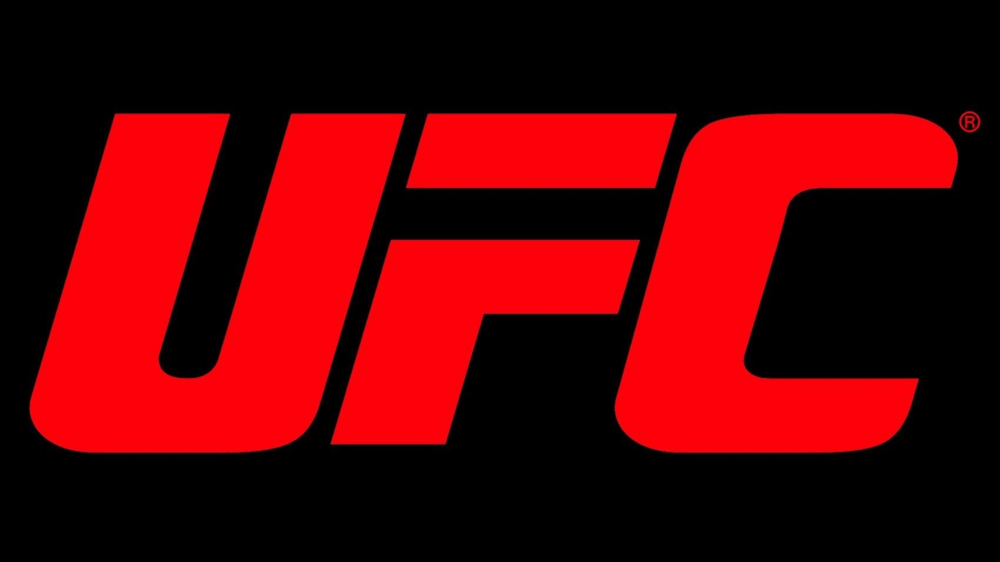

  

# 🥋 UFC Data Analysis

This repository contains an end-to-end data analysis project focused on historical and statistical insights into UFC (Ultimate Fighting Championship) fights and fighters. The project is divided into three main levels of depth: descriptive reports, analytical comparisons, and predictive modeling.

---

## 1. 🎯 Descriptive Reports

These reports give a general overview of UFC data. They are great for portfolio purposes or stakeholder presentations.

### 📈 UFC Historical Overview ✅
- Evolution of the number of fights per year ✅
- Most frequent host countries and cities ✅
- Distribution of fights per weight class over time ✅

### 🥊 General Fight Statistics ✅
- Win ratio by method: KO/TKO, submission, decision ✅
- Average fight duration per weight class ✅
- Most common submission techniques ✅
- Average strikes per minute or per round ✅

### 🧍 Fighter Statistics
- Top 10 fighters with the most wins ✅
- Fighters with the highest KO rate ✅
- Performance comparison by age ✅
- Average career length of fighters

---

## 2. 🧠 Analytical & Comparative Reports

These go deeper and highlight analytical thinking, correlations, and behavior patterns.

### 📊 What Influences a Fight Outcome?
- Correlation between height/reach and win probability
- Does making weight increase win chances?
- Do fighters coming off a win have a higher chance of winning again?

### 🤼‍♂️ Rivalries & Rematches
- Timeline of fights between the same opponents (e.g., McGregor vs Poirier)
- Performance evolution across trilogies
- Who tends to improve in rematches?

---

## 3. 🤖 Predictive Modeling (Advanced)

For those who want to apply machine learning to sports analytics.

### 🧪 Fight Outcome Prediction
- Predict the winner using fighter profiles: age, height, reach, fight record, recent performance
- Binary classification (Fighter A or B wins)
- Algorithms: Logistic Regression, Random Forest, XGBoost

### 📌 Clustering Fighter Styles
- Group fighters based on in-fight stats
- Example clusters: "aggressive striker", "technical grappler", "pace controller"

---

## 🛠️ Tools & Deliverables

| Report Type                         | Suggested Tools                                 |
|------------------------------------|-------------------------------------------------|
| PDF with static graphs             | Jupyter Notebook + matplotlib/seaborn + nbconvert |
| Interactive dashboards             | Streamlit, Plotly Dash, or Power BI            |
| Executive summary or presentation  | Canva, Google Slides, or LaTeX (for polished PDF) |

---

## 💡 Portfolio Example

**Title:** _"20 Years of UFC in Numbers: How MMA Evolved from 1994 to 2025"_

### Sections:
1. Introduction to the dataset
2. UFC historical timeline and trends
3. Win patterns and weight class analysis
4. Profile of top fighters and champions
5. Country-by-country analysis (e.g. Brazil, USA, Russia)
6. Predictive mini-model: what increases the chance of winning?
7. Strategic insights and takeaways

---

Feel free to fork or explore the notebooks to dive deeper into UFC analytics!